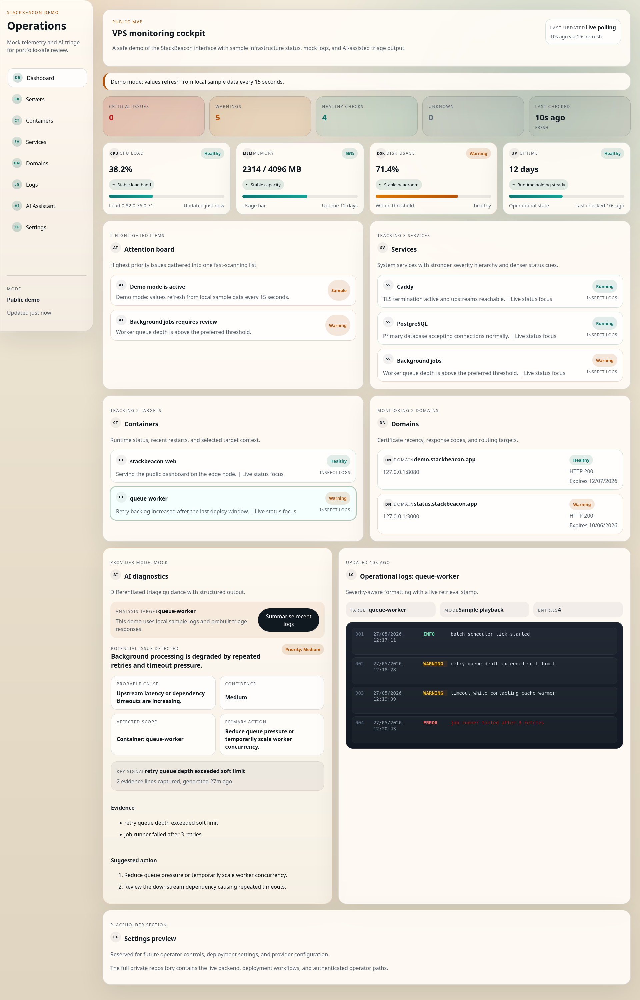
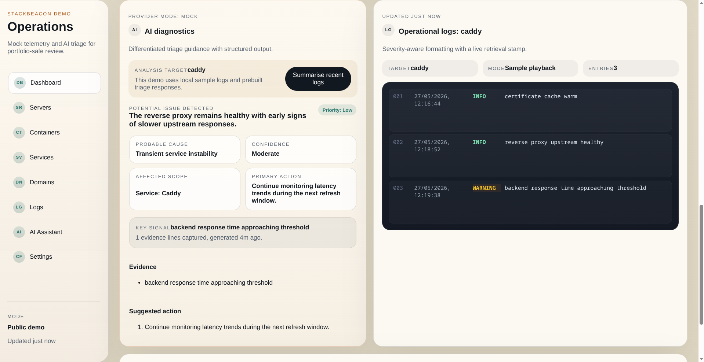
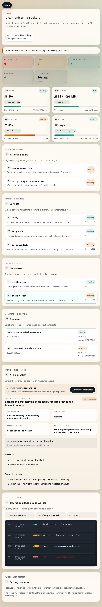
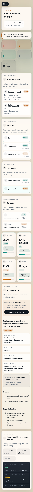

# StackBeacon

> A self-hosted VPS monitoring cockpit with AI-assisted diagnostics

StackBeacon is a product concept for operational visibility on self-hosted infrastructure. This public repository contains the demo/MVP version built for portfolio review, product walkthroughs, and UI/UX evaluation.

The demo intentionally uses safe mock telemetry and simulated AI diagnostics. The private production version contains the live Go services, local host inspection agent, persistence layer, and deployment workflow that are not appropriate to expose publicly.

## Public Demo Summary

- Public-safe dashboard experience using mock status data
- AI-assisted triage flow demonstrated with simulated evidence and next steps
- Responsive React interface for desktop and mobile review
- Security-first presentation of the product workflow without privileged host access

## Why This Exists

StackBeacon is designed to make VPS and small-server operations easier to read, triage, and act on. The project focuses on turning raw infrastructure status into a calmer, faster operational surface with clear severity cues and an AI-assisted investigation path.

This public repository demonstrates:

- the product direction
- the dashboard UX
- the triage workflow
- the information architecture
- the planned technical architecture

## Demo Scope

This repository demonstrates the UI/UX and product workflow using safe mock data.

The private production version is designed to use:

- Go backend API
- local Go host-inspection agent
- React frontend
- SQLite persistence
- Docker Compose deployment
- authenticated operator access
- provider-based AI integrations

## Screenshots

### Desktop Dashboard

Full operational overview showing dashboard summary cards, monitored services and containers, domain status, AI diagnostics, and the log panel in a single desktop layout.



### Log Panel And AI Diagnostics

Focused view of the AI-assisted triage workflow beside the operational log panel.



### Tablet Layout

Responsive tablet presentation of the main monitoring workflow.



### Mobile Layout

Single-column mobile view showing the same triage flow and status information in a compact layout.



## Live Demo

Live demo placeholder:

- URL: `TBD`
- Access mode: public read-only mock demo

## Features

- Responsive infrastructure dashboard layout
- Severity-aware service, container, and domain status presentation
- Operational log viewer with structured display
- AI-assisted diagnostic workflow with evidence and suggested actions
- Public-safe sample telemetry refresh cycle
- Mobile-friendly navigation and monitoring layout

## Technical Highlights

- React-based dashboard with modular state-formatting utilities
- Mock telemetry model that mirrors a future production monitoring flow
- AI triage presentation designed around structured evidence, severity, and next actions
- Planned Go API plus local Go agent architecture for production use
- Docker-compatible deployment model for the private version
- Security-first operator model that separates public demo from live infrastructure control

## Architecture Overview

### Public Demo Architecture

- Browser
- React frontend
- mock telemetry data
- simulated AI diagnostic output

### Planned Production Architecture

- Browser / React frontend
- Go backend API
- local Go inspection agent
- SQLite persistence
- Docker Compose deployment
- reverse proxy with Caddy or Nginx

See [docs/ARCHITECTURE.md](/home/kdawg/AI/VPS_Management_Dashboard/StackBeacon-Demo/docs/ARCHITECTURE.md) for the plain-text diagrams and deployment notes.

## Public Demo vs Private Full Version

### Public Demo

- UI/UX demonstration
- mock status data
- simulated AI diagnostics
- portfolio-safe repository
- no live infrastructure access

### Private Full Version

- Go backend API
- local Go agent
- SQLite persistence
- Docker and systemd inspection
- domain and SSL checks
- authenticated operator workflow
- planned provider-based AI integration
- protected operational and deployment logic

## Security-First Design Notes

The public demo intentionally avoids privileged server access and destructive actions for safety and security reasons.

That means this repository does not include:

- arbitrary command execution
- `sudo` access
- real server mutation
- production secrets
- privileged host checks

See [docs/SECURITY.md](/home/kdawg/AI/VPS_Management_Dashboard/StackBeacon-Demo/docs/SECURITY.md) for the full safety model.

## Planned Production Architecture

The production version is intended to support:

- provider modes for `mock`, `OpenAI`, `local/Ollama`, and `custom API`
- local-only agent binding
- environment-based configuration
- HTTPS behind Caddy or Nginx
- Docker Compose deployment
- allowlisted read and action surfaces
- audited operator actions

## Setup

### Requirements

- Node.js 22+
- npm 10+

### Run Locally

1. Install dependencies:

```bash
npm install
```

2. Start the demo:

```bash
npm run dev
```

3. Open [http://localhost:5173](http://localhost:5173)

### Build

```bash
npm run build
```

### Test

```bash
npm test
```

## Roadmap

### Phase 1: Public Demo

- responsive dashboard
- mock status data
- mock AI diagnostics
- portfolio documentation

### Phase 2: Read-Only Production MVP

- Go backend API
- local Go agent
- SQLite persistence
- Docker/container status
- systemd status
- log retrieval
- domain/SSL checks

### Phase 3: AI Diagnostics

- provider abstraction
- structured AI summaries
- severity classification
- evidence extraction
- suggested next actions
- cost/usage tracking

### Phase 4: Operator Actions

- restart service/container
- deployment history
- backup checks
- role-based access

See [docs/ROADMAP.md](/home/kdawg/AI/VPS_Management_Dashboard/StackBeacon-Demo/docs/ROADMAP.md) for the expanded version.

## License

This repository is released under the MIT license. See [LICENSE](/home/kdawg/AI/VPS_Management_Dashboard/StackBeacon-Demo/LICENSE).

## Note On Mock Mode

Mock mode exists to demonstrate the product professionally without exposing privileged infrastructure logic, operational risk, or private deployment details.

That is a deliberate security decision, not an unfinished placeholder.
